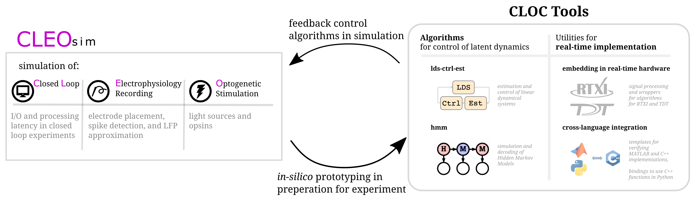

# CLOCTools
Hello, this is the overview page fo CLOCTools with links to its various repositories. CLOCTools are a library of tools for closed-loop neuroscience.
CLOC Tools includes algorthms for closed-loop control and tools for realtime implementation.  Additionally, related tools, such as the simulation/modeling tool CLEOsim, are also linked from this page.

## Overview
</img>

CLOCTools alogirthms include linear dynamical systems control estimation (ldsCtrlEst) and hidden markov model switching linear dynamical systems (hmm).  For implementation, CLOC tools has a variety of software for interfacing with the the real time tools RTXI and TDT along with tools for interfacing across programming languages.

## Core Algorithms

### **State-space dynamics** (GLDS, PLDS) [`stanley-rozell/ldsCtrlEst`](https://github.com/stanley-rozell/lds-ctrl-est)

</img>

ldsCtrlEst is a C++ library for estimation and control of linear dynamical systems (LDS) with Gaussian or Poisson observations. It is meant to provide the functionality necessary to implement feedback control of linear dynamical systems experimentally. This library was originally developed for the task of controlling neuronal activity using spike count data as feedback and optogenetic inputs for control.  ldsCtrlEst has both estimation and feedback control with parameter adaptive estimation, switched estimate and control, and can use both Gaussian and Poisson observation models.
  - [code](https://github.com/stanley-rozell/lds-ctrl-est), [documentation](https://stanley-rozell.github.io/lds-ctrl-est/)    
 

examples scripts:

  
  - GLDS control - [`eg_glds_ctrl.cpp`](https://stanley-rozell.github.io/lds-ctrl-est/docs/api/examples/eg_glds_ctrl_8cpp-example/#example-eg_glds_ctrl.cpp) - [tutorial](https://stanley-rozell.github.io/lds-ctrl-est/docs/tutorials/eg_glds_control/)
  - GLDS control of PLDS - [`eg_glds_du_plds_ctrl.cpp`](https://stanley-rozell.github.io/lds-ctrl-est/docs/api/examples/eg_glds_du_plds_ctrl_8cpp-example/#example-eg_glds_du_plds_ctrl.cpp)
    - change in control (du) is being updated, rather than amplitude (u).
  - PLDS control - [`eg_plds_ctrl.cpp`](https://stanley-rozell.github.io/lds-ctrl-est/docs/api/examples/eg_plds_ctrl_8cpp-example/#example-eg_plds_ctrl.cpp)
  - PLDS estimation - [`eg_plds_est.cpp`](https://stanley-rozell.github.io/lds-ctrl-est/docs/api/examples/eg_plds_est_8cpp-example/#example-eg_plds_est.cpp) - [tutorial](https://stanley-rozell.github.io/lds-ctrl-est/docs/tutorials/eg_plds_state_estimation/)
  - Switched PLDS control [`eg_plds_switched_ctrl.cpp`](https://stanley-rozell.github.io/lds-ctrl-est/docs/api/examples/eg_plds_switched_ctrl_8cpp-example/#example-eg_plds_switched_ctrl.cpp) - [tutorial](https://stanley-rozell.github.io/lds-ctrl-est/docs/tutorials/eg_switched_plds_control/)
  

RTXI modules:

  - [rtxi-gldsController](https://github.com/stanley-rozell/rtxi-gldsController)
  - [rtxi-pldsSimulator](https://github.com/stanley-rozell/rtxi-pldsSimulator)
  - [rtxi-pldsSwitchedController](https://github.com/stanley-rozell/rtxi-pldsSwitchedController)

<!-- - ( 🚧python example by kjohnsen) -->

### **Latent-switch decoding** (HMM) [`stanley-rozell/hmm`](https://github.com/stanley-rozell/hmm)

</img>

hmm is a simple set of hidden Markov model (HMM) code intended to support control of switching linear dynamical systems. It contains methods for generating and decoding systems with discrete latent states and discrete observed signals.

  - [code](https://github.com/stanley-rozell/hmm), [documentation](https://stanley-rozell.github.io/hmm/)
  - example script with build, simulate, and decode - [`test/main.cpp`](https://github.com/stanley-rozell/hmm/blob/master/misc/test-cmake-installation/src/main.cpp), [tutorial](https://stanley-rozell.github.io/hmm/_tutorial.html)
  - RTXI modules:
    - [rtxi-hmmDecoder](https://github.com/stanley-rozell/rtxi-hmmDecoder)
    - [rtxi-hmmGenerator](https://github.com/stanley-rozell/rtxi-hmmGenerator)

<!-- ### Local field potential (LFP) decoding
https://github.com/stanley-rozell/lfp-cpp-library
https://github.com/stanley-rozell/lfp-cpp-library/blob/master/src/lfpRatiometer.cpp -->

### State-aware (switched) control of neural dynamics (StAC)
StAC allows for model-based control and estimation of a switched (PLDS) system. It relies on the [stanley-rozell/ldsCtrlEst](https://github.com/stanley-rozell/lds-ctrl-est) and [stanley-rozell/hmm](https://github.com/stanley-rozell/hmm) libraries.
Building a switched control loop is demonstrated at [`eg_plds_switched_ctrl.cpp`](https://stanley-rozell.github.io/lds-ctrl-est/docs/tutorials/eg_switched_plds_control/), an RTXI wrapper for switched control of a PLDS system suitable for custom decoding is available at [rtxi-pldsSwitchedController](https://github.com/stanley-rozell/rtxi-pldsSwitchedController), and an RTXI wrapper for switched control of a PLDS using an HMM for decoding is available at [rtxi-StAC](https://github.com/stanley-rozell/rtxi-StAC). *See also section [Satellite:StAC](#StAC-analysis-manuscript-figures)) for analysis code and manuscript figures.*

## Implementation tools

### Cross-language utilities

CLOCTools makes use of a variety of progamming languages.  For instance, lds-ctrl-est uses C++ while CLEOSim uses python.  This section lists tools to interface across these languages.

- [eg-cpp-library](https://github.com/stanley-rozell/eg-cpp-library) - An example repository for C++ library development
- [lds-ctrl-est-pybind]() - python bindings to lds-ctrl-est core C++ functionality
- [cpp-matlab-demos](https://github.com/stanley-rozell/hmm/tree/master/matlab) - using mex to verify algos in c++ *(currently a part of HMM repository)*

### Real-time utilities

In order to make use of real time utilites, a variety of wrappers and signal processors are needed.  Repositories for these wrappers and signal processors relevant to particular tools are listed in the sections with those tools, while more general respositories for real time utilites are listed in this section.

#### RTXI

</img>

[RTXI](http://rtxi.org/), the Real-Time eXperiment Interface, is a hard real-time data acquisition and control application for biological research. At its core is a Real-Time Operating System (RTOS), which uses a modified Linux kernel to provide deterministic control in a variety of experimental settings. RTXI is a fast, free, and open-source system currently used in labs all over the world to probe diverse, technologically challenging problems, such as dynamic probing of ion-channel function, control of cardiac arrhythmia dynamics, and control of deep-brain stimulation patterns.  We have repositories with useful tools for interfacing with and configuring RTXI.

- [rtxi-settings](https://github.com/stanley-rozell/rtxi-settings) -  RTXI experiment settings   
- [stimLoader](https://github.com/stanley-rozell/rtxi-stimLoader) - Stimulus and parameter I/O 

RTXI signal processing modules  
  
  
- https://github.com/old-rtxi-utilities
- [quanitzer](https://github.com/old-rtxi-utilities/rtxi-quantizer)
- [gain modulation](https://github.com/old-rtxi-utilities/rtxi-gain_mod)
- [limiter](https://github.com/old-rtxi-utilities/rtxi-limiter)
 - [nonlinearity & spiking](https://github.com/old-rtxi-utilities/rtxi-nonlin_spike)
  

#### TDT  

</img>

Tucker Davis Technologies ([TDT](https://www.tdt.com/)) have a variety of hardware and software solutions for neuroscience.  We have respositories with useful tools for interfacing with TDT hardware and software. 

TDT utilities:

  - [rtxi-tdtSpikes](https://github.com/stanley-rozell/rtxi-tdtSpikes) - retrieve spike counts from TDT
  - [rtxi-tdtLFP](https://github.com/stanley-rozell/rtxi-tdtLFP) - receive local field potential (LFP)
  - [tdtUDP](https://github.com/stanley-rozell/tdtUDP) - A repository for receiving/sending data through Tucker Davis Technologies UDP interface

## Satellite repositories 
These projects contain related work that doesn't necessarily fit into the primary focus of CLOCTools or have their own goals seperate from CLOCTools.  They are listed here for completeness and relevance.  Of particular importance is CLEOSim which can serve to test the algorithms in ldsCtrlEst and hmm and to prototype experiments in-silico.
### StAC (analysis & manuscript figures)
[StAC](https://github.com/awillats/state-aware-control) - State-aware control of switching neural dynamics.  StAC applies control, decoding, and estimation to switching models of neural responses. Hidden Markov models and Poisson linear dynamical systems are used to design and characterize feedback in simulation and are compared to non-switching “state-naive” approaches. Real-time implementation is provided by [stanley-rozell/rtxi-StAC](#state-aware-switched-control-of-neural-dynamics-stac), however [stanley-rozell/state-aware-control-manuscript](https://github.com/awillats/state-aware-control) contains additional simulations, analysis, and plotting (in MATLAB) for the associated manuscript *(in preparation)*.
<!-- will get transferred over to stanley-rozell/state-aware-control -->

### CLEOSim

</img>

[CLEOsim](https://github.com/kjohnsen/cleosim) - Closed Loop, Electrophysiology, and Optogenetics Simulator

CLEOsim (Closed Loop, Electrophysiology, and Optogenetics Simulator) is a Python package built on the Brian 2 spiking neural network simulator developed bridging theory and experiment for mesoscale neuroscience, facilitating electrode recording, optogenetic stimulation, and closed-loop experiments.  In conjunction with algorithm toolsets such as lds-ctrl-est and HMM, CLEOSim can test contol algorithms for use in closed-loop neuroscience on Brian 2 spiking neural network models.  In conjunction with implementation toolsets such as lds-ctrl-est-pybind, CLEOSim can also serve to prototype closed-loop experiments in silico and to test control algorithms on various models of mesoscale neural activity.

</img>

- [code](https://github.com/kjohnsen/cleosim), [documentation](https://cleosim.readthedocs.io/en/latest/)

Examples and Tutorials:

  - [PI Control](https://github.com/kjohnsen/cleosim/blob/master/docs/tutorials/PI_ctrl.ipynb)
  - [electrode setup](https://github.com/kjohnsen/cleosim/blob/master/docs/tutorials/electrodes.ipynb)
  - [on-off control](https://github.com/kjohnsen/cleosim/blob/master/docs/tutorials/on_off_ctrl.ipynb)
  - [optogenetics](https://github.com/kjohnsen/cleosim/blob/master/docs/tutorials/optogenetics.ipynb)
  - [LQR Control using ldsCtrlEst](https://github.com/kjohnsen/cleosim/blob/master/docs/tutorials/lqr_ctrl_ldsctrlest.ipynb)

### CLINC
[CLINC](https://github.com/awillats/clinc) - Closed-loop identifiability in neural circuits. This project proposes a framework for understanding the impact of open and closed-loop interventions in identifying neural circuits. This manuscript (in preparation) summarizes the role of stimulation in circuit inference and demonstrates how to design interventions through simple gaussian network simulations. See also [https://github.com/awillats/brian_delayed_gaussian](awillats/brian_delayed_gaussian) for simulating networks of Gaussian nodes with delayed connections in the Brian2 simulator framework.
